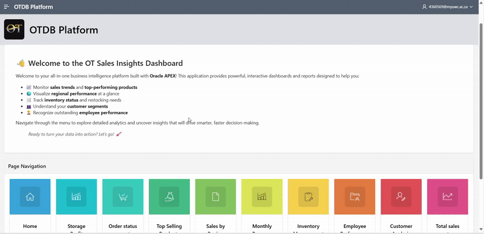

# ot-company-apex-project
A sample Oracle APEX application built using the OT (Order Transactions) schema, with SQL scripts and live app demo.


# 📊 OT Enterprise Analytics Dashboard – Oracle APEX Project

A modern enterprise web application built using **Oracle APEX**, the **OT schema**, and **SQL analytics**, designed to support **data-driven decision-making** for a global e-commerce company. This application transforms raw transactional data into meaningful insights through visual dashboards, interactive reports, and advanced data querying capabilities.

> 🧠 Built to demonstrate how traditional enterprise systems can evolve with embedded analytics and visual intelligence to enable smarter, faster decisions.

---

## 🧠 Case Study Context

OT is a multinational e-commerce supplier specializing in high-performance computer hardware (CPUs, GPUs, RAM, storage, and motherboards). With operations spanning multiple countries, OT manages complex data on customers, products, warehouses, employees, and global orders.

Despite having a comprehensive relational database, the company **lacks analytical capabilities** in its enterprise systems.

> 🎯 **Objective**: Design a data analytics web application using **Oracle APEX** to transform OT’s operational data into business intelligence.

---

## 📌 Project Objectives

- ✅ Import and use the **OT schema** and **sample dataset** for relational data modeling
- ✅ Develop an **Oracle APEX** web application focused on **analytics and data visualization**
- ✅ Present key performance indicators and operational trends across sales, customers, inventory, and geographic regions
- ✅ Provide OT with actionable insights to guide strategic planning and operational optimization

---

## 🚀 Features & Functionality

### 📋 Data Reports (5+)
- 📦 **Product Inventory Report** – Stock levels per warehouse
- 🛒 **Order Report** – Orders sorted by region and customer type
- 👥 **Customer Segmentation** – Purchase frequency and categories
- 🧾 **Employee Sales Summary** – Top-performing sales representatives
- 🌍 **Warehouse Efficiency** – Location-wise product distribution

### 📈 Visualizations (5+)
- 📊 **Bar Chart** – Sales by region
- 📈 **Line Chart** – Monthly order volume trends
- 🥇 **Pie Chart** – Revenue share by product category
- 🌐 **Geo Map (Region)** – Visual warehouse distribution
- 📉 **Bubble Chart** – Customer order value vs frequency

All visualizations are interactive and built using **native Oracle APEX charting tools**.

---

## 📂 Project File Structure


---

## 🎬 Application Demo

> A walkthrough of the APEX application's dashboard, showing live charts and interactive reports built on the OT dataset.



🎥 **Full Demo Video**  
*Compressed MP4 included in the `/docs/` folder for offline review.*  
📁 `docs/demo.mp4`

---

## 🛠️ Setup Instructions

1. Import `ot_create_tables.sql` and `ot_data.sql` into your Oracle DB
2. Import `apex_app_export.sql` into your APEX workspace
3. Run the app and explore!

### 🧩 1. Database Initialization
Run the following in your Oracle DB environment (SQL Developer, SQLcl, etc.):

```sql
@ot_create_tables.sql
@ot_data.sql
@apex_app_export.sql

